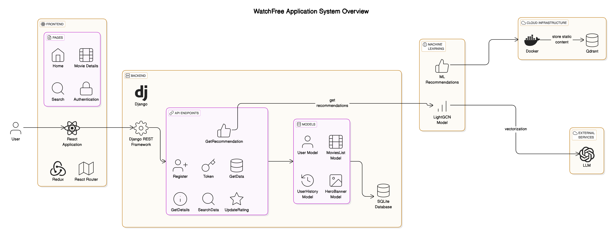

# WatchFree - Movie Streaming & Recommendation System

**WatchFree** is a full-stack movie streaming and recommendation platform built using **Django**, **React**, and a **LightGCN-based machine learning recommendation model**. The platform allows users to explore movies, receive personalized recommendations, rate movies, and engage with movie content. The recommendation system uses collaborative filtering to suggest movies based on user preferences.

## Features

- **User Authentication**: Register, login, and access personalized movie recommendations.
- **Movie Database**: Browse movies based on genres, ratings, and more.
- **Search Functionality**: Search for movies based on title, genre, or ratings.
- **Movie Recommendations**: Get personalized movie suggestions based on your ratings and movie interactions.
- **User Ratings**: Rate movies and keep track of your ratings history.
- **Responsive UI**: The frontend is built with **React** and **Redux** for dynamic user interaction.

## Tech Stack

### Backend:
- **Django**: A Python-based web framework to handle backend functionality.
- **Django REST Framework**: For building the RESTful API to serve the frontend.
- **SQLite**: Local database to store movie and user data.
- **JWT Authentication**: Using **`rest_framework_simplejwt`** for secure API access.

### Frontend:
- **React**: JavaScript library for building the user interface.
- **Redux**: For state management across the application.
- **Axios**: For making API requests from the frontend to the backend.

### Machine Learning:
- **LightGCN**: A **Light Graph Convolutional Network** for collaborative filtering-based movie recommendations.
- **MovieLens-1M Dataset**: The dataset used for training the recommendation model.

### Cloud & Infrastructure:
- **AWS EC2**: For backend deployment.
- **Amazon S3**: For storing movie-related static content like images and banners.
- **Qdrant**: A vector database for storing movie embeddings.
- **OpenAI**: For generating embeddings using OpenAI's **Embedding API**.

## Project Architecture

### **Overview**
The system consists of a **Django backend** that interacts with a **React frontend**, and a **LightGCN-based recommendation system**. The movie embeddings are stored in **Qdrant**, and **OpenAI's Embedding API** is used to convert movie overviews into vector representations for efficient semantic search.

### **Architecture Diagram**

Below is an architectural overview of the "WatchFree" system:


### **Backend Components**

1. **User Authentication**:
   - **Registration**: `/api/register/`
   - **Login**: `/api/token/` (JWT-based authentication)
   
2. **Movie Data**:
   - **Fetch Movies**: `/api/getdata/` (Fetches lists like Top-Rated, Popular, etc.)
   - **Movie Details**: `/api/getdetails/` (Fetches details for individual movies)
   
3. **Recommendation System**:
   - **Get Recommendations**: `/api/get_recommendation/` (Provides personalized movie suggestions using LightGCN)
   
4. **Search**:
   - **Search Movies**: `/api/searchdata/` (Search movies based on query)
   
5. **Ratings**:
   - **Rate Movies**: `/api/update_rating/` (Allow users to rate movies)

---

### **Frontend Components**

- **Home Page**: Displays a Hero Banner, Recommended Movies, Top-Rated Movies, and most Popular Movies.
- **Movie Details**: Detailed view of individual movies, including description, rating, and a trailer.
- **Search Page**: Allows users to search for movies based on keywords.
- **Authentication**: Login and Registration pages.

---

### **Machine Learning (LightGCN)**

- **LightGCN (Light Graph Convolutional Network)**: This model is used to make personalized movie recommendations based on user ratings and movie interactions.
- **Vectorization**: Movie descriptions are vectorized using **OpenAI's Embedding API** to create embeddings for semantic search.
- **Embedding Storage**: These embeddings are stored in **Qdrant** for efficient querying and retrieval during recommendation generation.

---

### **How It Works**

1. **User Uploads Movie Data**: The backend processes user ratings and movie data.
2. **Movie Embeddings**: Movie descriptions (overviews) are embedded into high-dimensional vectors using **OpenAI's Embedding API**.
3. **Store Embeddings**: These vectors are stored in **Qdrant**, a vector database for fast similarity searches.
4. **Recommendation Query**: When a user requests recommendations, the system queries **Qdrant** for similar movie embeddings and retrieves the best-matching movies.
5. **Return Recommendations**: The backend sends the recommended movies to the frontend, which displays them to the user.

---

## Setup Instructions

### Backend Setup

1. Clone the repository:
   ```bash
   git clone https://github.com/yourusername/WatchFree.git
   cd WatchFree
   ```

2. Install dependencies:
   ```bash
   pip install -r requirements.txt
   ```

3. Apply migrations and set up the database:
   ```bash
   python manage.py migrate
   ```

4. Start the backend server:
   ```bash
   python manage.py runserver
   ```

### Frontend Setup

1. Navigate to the `frontend/` directory:
   ```bash
   cd frontend
   ```

2. Install dependencies:
   ```bash
   npm install
   ```

3. Start the frontend server:
   ```bash
   npm start
   ```

---

## Contributing

Feel free to fork the repository, open issues, or submit pull requests. Contributions are always welcome! For any questions or setup-related issues, please reach out via GitHub issues.

---


